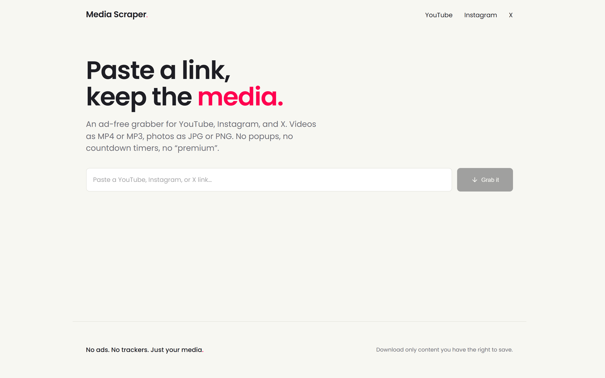
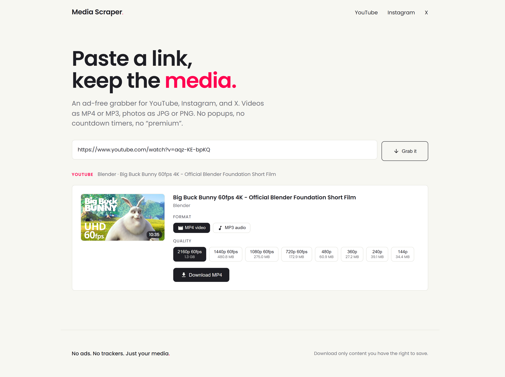
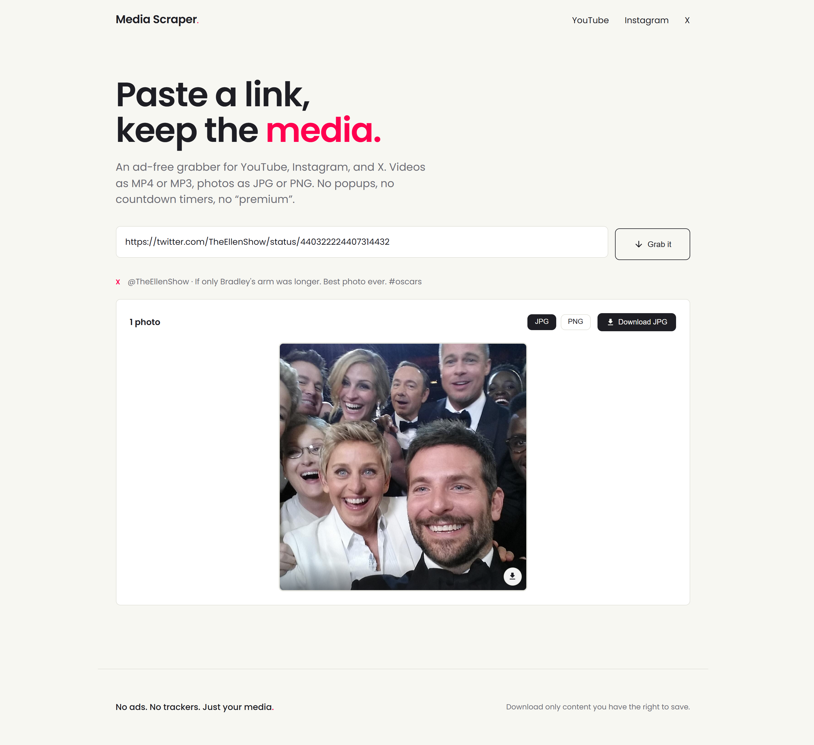
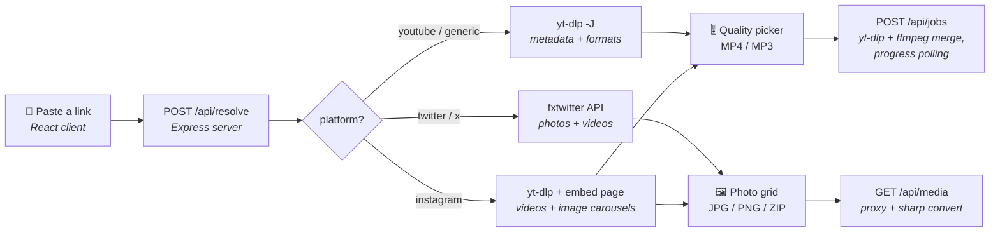

<div align="center">

# Media Scraper · Paste a link, keep the media

### An ad-free media grabber for YouTube, Instagram, and X — MP4, MP3, JPG, or PNG. No popups, no countdown timers, no "premium".

<br />







</div>

---

## ✨ What it does

Paste a share link and Media Scraper figures out what's behind it:

- 🎬 **Videos** (YouTube, reels, video tweets) → download as **MP4** with a real quality ladder (2160p → 144p, with file-size estimates), or rip the audio as **MP3**
- 🖼️ **Photo posts** (Instagram carousels, image tweets) → every photo in a selectable grid; download each as **JPG or PNG** (converted server-side), pick a few, or grab the whole set as one **ZIP**
- 📊 **Live progress** — video downloads run as server-side jobs and stream a progress bar to the UI
- 🎨 **Clean, minimal design** — Poppins, a warm off-white canvas, near-black ink, and one hot-pink accent, matching my [personal portfolio](https://github.com/jaguan2)

## 🏗️ How it works

Unlike a pure-frontend converter, scraping needs a server — platforms block browser-side fetching with CORS and hotlink protection. So Media Scraper is two npm workspaces:



- **yt-dlp** (auto-downloaded by `youtube-dl-exec`) does the heavy extraction; **ffmpeg** (`ffmpeg-static`) merges video+audio into MP4 and extracts MP3
- **sharp** converts photos to JPG/PNG on the fly as they stream through the `/api/media` proxy
- Photo ZIPs are assembled **client-side** with `fflate` — the server just streams the images
- Downloads run in per-job temp dirs under the system temp folder that are deleted right after the file is streamed; stale jobs are swept hourly

## 📁 Code structure

```
web-scrapper/
├── package.json          # npm workspaces root: `npm run dev` starts both apps
├── docs/                 # README screenshots
├── server/               # Express API (port 5175)
│   ├── index.js          # routes: /api/resolve, /api/media, /api/jobs
│   └── lib/
│       ├── ytdlp.js      # yt-dlp wrapper, shared flags, friendly error mapping
│       ├── normalize.js  # raw yt-dlp JSON → { platform, items[] } shape
│       ├── resolve.js    # per-platform resolution strategy
│       ├── twitter.js    # fxtwitter API (photo tweets + video enrichment)
│       ├── instagram.js  # embed-page scrape for image posts/carousels
│       ├── media.js      # image proxy + sharp JPG/PNG conversion
│       └── jobs.js       # download job manager: spawn, progress, stream, cleanup
└── client/               # Vite + React + MUI (port 5173, /api proxied to 5175)
    └── src/
        ├── theme/        # palette, MUI theme factory (Poppins + portfolio look)
        ├── components/
        │   ├── layout/   # Header (nav), Footer, AppLayout, Logo
        │   ├── common/   # Button, SegmentedControl
        │   └── scrape/   # LinkInput, VideoCard (quality ladder), GalleryCard (grid + ZIP)
        ├── pages/        # ScrapePage — hero + state machine (idle/loading/done/error)
        └── utils/        # api client, download/zip helpers, formatters
```

## 🚀 Running locally

Requires **Node 20+**. First install downloads the `yt-dlp` and `ffmpeg` binaries automatically — no Python or system installs needed.

```bash
npm install
npm run dev
```

Then open **http://localhost:5173**. The API listens on 5175; Vite proxies `/api` to it.

| Command         | Description                                        |
| :-------------- | :------------------------------------------------- |
| `npm run dev`   | Start API + client together (concurrently)         |
| `npm run build` | Build the client for production                    |
| `npm start`     | Serve the API + built client from one process      |

## 🔐 Instagram & age-restricted content

Public reels and most posts work out of the box. Private accounts, some carousels, and age-restricted videos need a logged-in session:

1. Install a "cookies.txt" browser extension (e.g. *Get cookies.txt LOCALLY*)
2. Log in to the site in your browser, export cookies in Netscape format
3. Save the file as `server/cookies.txt` (it's gitignored — never commit it)

Every yt-dlp call picks it up automatically.

## ⚠️ A note on use

Media Scraper is a personal, ad-free alternative to sketchy downloader sites. Download only content you have the right to save (your own posts, licensed/CC media, etc.) and respect each platform's terms of service. Extractors depend on how platforms behave — if one breaks, updating yt-dlp (`npm update youtube-dl-exec`) usually fixes it.
